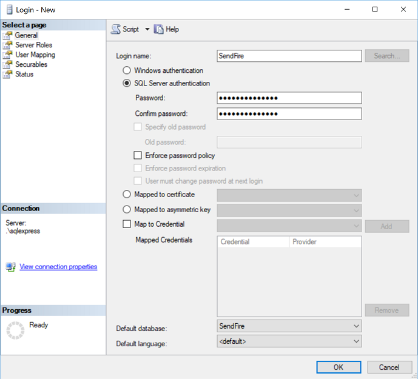
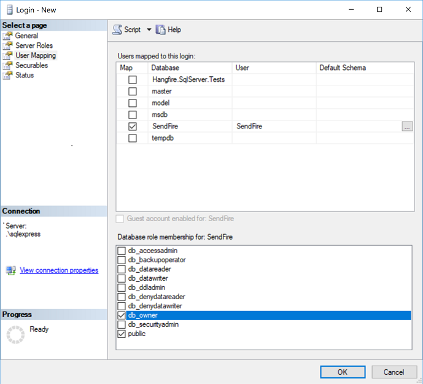

# SendFire
A .NET Core Based Server Deployment and Command Execution System that uses a fork of [Hangfire](http://github.com/HangfireIO/Hangfire) for its Scheduling Engine

SendFire is two components:
1. An ASP.NET Core 2.0 Administration Web Portal that allows for administration of Nodes in your network.
2. A .NET Core 2.0 Windows Service which runs locally on all servers that you wish to become nodes on your network that can be controlled by the SendFire Administration Portal.

Developer Information
---------------------
SendFire Requires the following programs to be installed for local Development:
1. [SQL Server Express](https://www.microsoft.com/en-us/sql-server/sql-server-editions-express) for the Hangfire / SendFire Job and Node information Storage. SQL Server Express 2017 or above is recommended.
2. [SQL Management Studio](https://docs.microsoft.com/en-us/sql/ssms/download-sql-server-management-studio-ssms) should also be installed to manage SQL Server Express and also to view and interact with the SendFire database directly. Version 17.4 or above is recommended.
3. [.NET Core SDK](https://www.microsoft.com/net/download/windows), 2.1.2 or above recommended.
4. [Node.JS](https://nodejs.org/en/) for NPM Package Management. If running on Windows we recommend [Node Version Manager for Windows](https://github.com/coreybutler/nvm-windows/releases) to simplify local node version control.
5. [Visual Studio 2017 Community or Visual Studio Code](https://www.visualstudio.com/) is Recommended as a code editor.

To run a local developement environment of Sendfire in Visual Studio Code, open a terminal window and run the following:
1. `npm install` will install all the local node packages necessary to run.
2. `dotnet restore` will install all the local nuget packages necessary to run.
3. `dotnet watch run` will build and run the local web aministration portal.
4. Open your favorite browser and go to https://localhost:5000/ to view and interact with SendFire.

SQL Server Exrepss Setup for Development
----------------------------------------
The connection string in SendFire expects a SQL Server Express installation using the default installation location on the local host `.\sqlexpress`. *Mixed mode authentication* is also required as the Web Application will attempt to login using the SQL Server user created below. If you don't want to use this setup you will need to modify connection string in your local copy of the appsettings.json according to whatever SQL Server and authentication setup you want to use.

If you intend to use the default authentication setup in the connection string, during installtion of SQL Server Express you must select a *custom installation* in order to allow **mixed mode authentication**, or you can allow it after the fact by doing the following:

1. Using SQL Management Studio, log in to the local `.\sqlexpress` installation as an administrator, right click on the server and select *Properties*.

2. Go the the *Security* tab and verify or set authentication like this:

SendFire DB and User Setup for Development
------------------------------------------
1. Setup a blank **SendFire** database in SQL Management Studio.

2. Create a **SendFire** user using the following settings. The users default password is `SendFire2017#!`.

